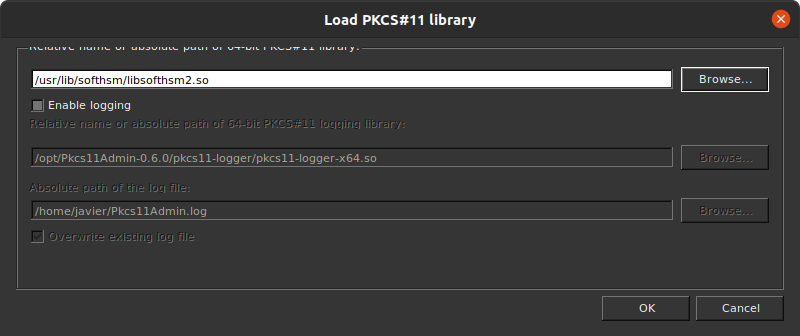
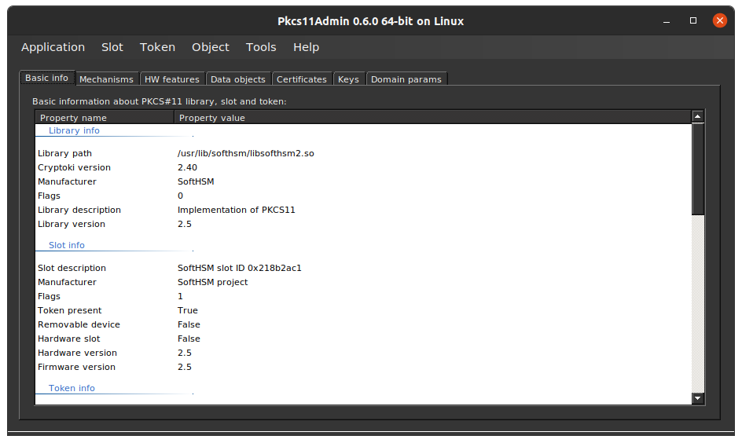
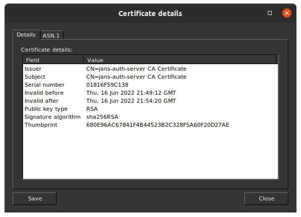

# jans-eleven

## Install [SoftHSM](https://www.opendnssec.org/softhsm/)

```shell
sudo apt-get install softhsm
```

## Init SoftHSM

```shell
sudo softhsm2-util --init-token --slot 0 --label "My test token"
```

## Configure jans-eleven

List the available slots and look for the Slot id:

```shell
$ softhsm2-util --show-slots

Available slots:
Slot 123456789
    Slot info:
        Description:      SoftHSM slot ID 0x75bcd15
        Manufacturer ID:  SoftHSM project
        Hardware version: 2.5
        Firmware version: 2.5
        Token present:    yes
    Token info:
        Manufacturer ID:  SoftHSM project
        Model:            SoftHSM v2
        Hardware version: 2.5
        Firmware version: 2.5
        Serial number:    abcdef1234567890
        Initialized:      yes
        User PIN init.:   yes
        Label:            My test token
```

Copy the file ```Server/conf/jans-eleven.json``` to ```$CATALINA_HOME/conf/jans-eleven.json```.

Edit the configuration file ```jans-eleven.json```:

```json
{
  "pkcs11Config": {
    "name": "SoftHSM",
    "library": "/usr/lib/softhsm/libsofthsm2.so",
    "slot": "123456789"
  },
  "pkcs11Pin": "1234",
  "dnName": "CN=jans-auth-server CA Certificate",
  "testModeToken": "xxxxxxxx-xxxx-xxxx-xxxx-xxxxxxxxxxxx"
}
```

Attribute     | Value                                 | Description
--------------|---------------------------------------|-----------------------------------------------------------------
name          | Name suffix of this provider instance | This string is concatenated with the prefix SunPKCS11- to produce this provider instance's name (that is, the string returned by its Provider.getName() method). For example, if the name attribute is "SoftHSM", then the provider instance's name will be "SunPKCS11-SoftHSM".
library       | Pathname of PKCS#11 implementation    | This is the full pathname (including extension) of the PKCS#11 implementation; the format of the pathname is platform dependent. For example, /opt/foo/lib/libpkcs11.so might be the pathname of a PKCS#11 implementation on Linux while C:\foo\mypkcs11.dll might be one on Windows.
slot          | Slot ID                               | This is the id of the slot that this provider instance is to be associated with. For example, you would use 1 for the slot with the id 1 under PKCS#11.
pkcs11Pin     | Personal Identification Number        | Certain PKCS#11 operations, such as accessing private keys, require a login using a Personal Identification Number, or PIN, before the operations can proceed. The most common type of operations that require login are those that deal with keys on the token.
dnName        | DN of certificate issuer              | DN of certificate issuer.
testModeToken | Access Token                          | Token used to consume the rest services.

Deploy ```jans-eleven.war``` in Jetty

## Configure to run as non-root (Development)

```shell
cd $HOME

mkdir -p $HOME/lib/softhsm/tokens

cd $HOME/lib/softhsm/

echo "directories.tokendir = $PWD/tokens" > softhsm2.conf

export SOFTHSM2_CONF=$HOME/lib/softhsm/softhsm2.conf

softhsm2-util --init-token --slot 0 --label "My test token" --so-pin 1234 --pin 1234
```

## PKCS#11 Management Tool

Manage the issued certificates with [Pkcs11Admin](https://www.pkcs11admin.net/) 






